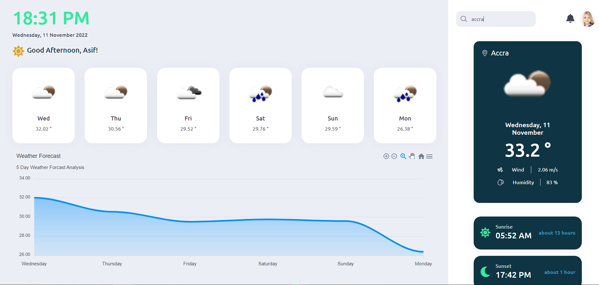

# React Desktop Weather Application

A simple desktop weather application to instantly access forecasts, warnings and other useful weather information base on user location and searches.

## Table of contents

- [Overview](#overview)
  - [The challenge](#the-challenge)
  - [Screenshot](#screenshot)
  - [Links](#links)
- [My process](#my-process)
  - [Built with](#built-with)
- [Author](#author)

## Overview

### The challenge

Users should be able to:

- View weather patterns based on user location
- search weather information for any location
- Give an summary analysis overview of the weather forecast patterns

### Screenshot

### Links

- Live Site URL: [View Demo](https://react-weather-application-eight.vercel.app/)

### Built with

- Semantic HTML5 markup
- CSS custom properties
- Flexbox
- CSS Grid
- React
- Rxjs
- Prime React
- React live clock
- Apex Chart

## Author

- Website - [Stephen Addom Addae](https://react-weather-application-eight.vercel.app/)
- Twitter - [@Alaska67524884](https://twitter.com/Alaska67524884)
